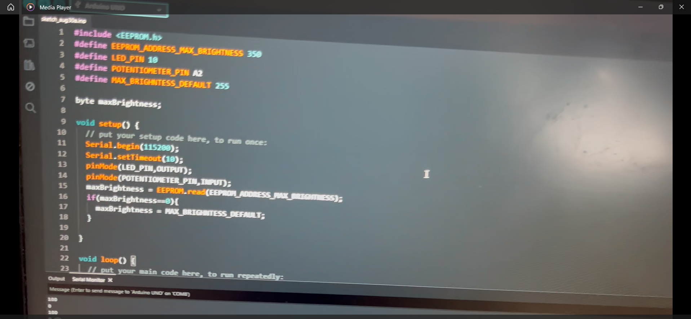

# EEPROM
EEPROM simply allows us to save small values into the Arduino. I used it here to input a number that controls the maximum brightness of an LED.
This project uses an Arduino to control an LED's brightness with a potentiometer. The potentiometer controls the brightness from 0–255, while the Serial Monitor allows you to set a maximum brightness limit. This limit is then saved to the Arduino's EEPROM, meaning the Arduino can remember your chosen brightness even after being turned off and powered back on.

 ## Video Demonstration

Click the thumbnail below:

